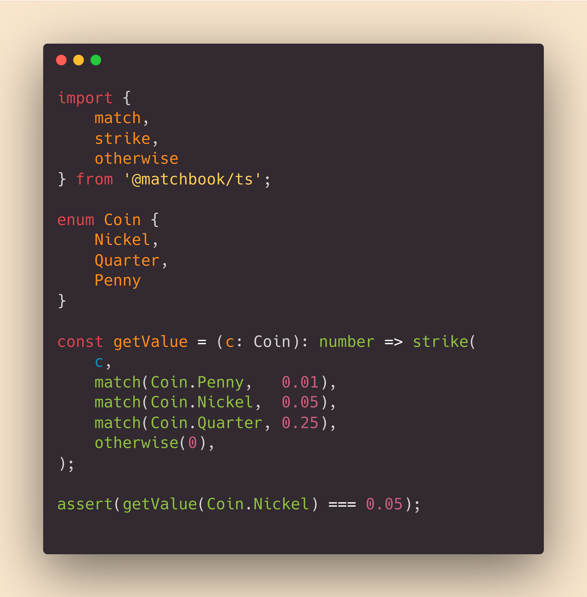

# 🔥 matchbook
## pattern matching in typescript & javascript made easy

matchbook is a lightweight & easy to use pattern matching library,
for TypeScript and JavaScript.

If you want to know more about matchbook,
[check out the docs][api_docs] or [read on](#table-of-contents)!

If you want to start using matchbook, install it like any other npm package:

`npm i @matchbook/ts`

---
 
[![npm version][npm_ver_badge]][npm_link]
[![pkg size][npm_size_badge]][npm_link]
[![build][build_badge]][build_link]
[![source rank][source_rank_badge]][libraries_io]

![top lang][lang_badge]
[![codacy][codacy_badge]][codacy_link]
[![codecov][codecov_badge]][codecov_link]
![license][license_badge]

## table of contents

-   [what matchbook does for you](#what-matchbook-does-for-you)

-   [what you can do for matchbook](#what-you-can-do-for-matchbook)

-   [pattern matching explained](#pattern-matching-explained)

-   [matchbook at a glance](#matchbook-at-a-glance)

-   [matchbook at a slightly longer glance (examples)](#matchbook-at-a-slightly-longer-glance)
    -   [switching on an `enum`](#switching-on-an-enum)
    -   [acting on the type of an Event](#acting-on-the-type-of-an-event)
    -   [matching if a value is an `instanceof` a constructor](#matching-if-a-value-is-an-instanceof-a-constructor)

## what matchbook does for you
_(list is in no particular order)_

-   **expressive** - pattern matching helps you write **less code** that's **more expressive** than if/else trees
-   **simple** - API is just 5 functions, 1 error class, and some stylistic aliases for the core functions
-   **powerful** - type inference backed by Typescript
-   **well documented** - [check out the docs here!][api_docs]
-   **low cost** - no runtime dependencies, & small package size
-   **reliable** - 100% unit test coverage, with all pushes verified via Travis CI 

## what you can do for matchbook
### use it!

The project is currently in `beta`, meaning the functionality & API are complete &
fully covered by tests, but the library hasn't been battle-tested and may need
some final tweaks before v1.0.0.

### watch it!

Watch the project for releases to be notified of cool new features,
and the v1.0.0 release!

**ask questions!**

If you have any questions, any feedback, or just want to shoot the shirt,
[open an issue][new_issue] of type `question`, and we'll do our best to answer quickly!

## pattern matching explained
Pattern matching is a  modern language feature that is similar to a `switch` / `case` statement.

With pattern matching, you can switch on the _type_ of the incoming value,
meaning you can reduce a lot of extra-verbose if-else branches just by
replacing them with pattern matching statements.

You might consider using pattern matching if you find you're switching on types
or states frequently, and want to handle the different cases in a 
concise and expressive way.

This project takes heavy inspiration from [Rust's pattern matching idiom][rust_match].

## matchbook at a glance
want to know more? [read the docs][api_docs]!

## matchbook at a slightly longer glance
want to know more? [read the docs][api_docs]!

### switching on an `enum`

### acting on the type of an Event

### matching if a value is an `instanceof` a constructor

[api_docs]: https://matchbook-ts.github.io/matchbook-ts/docs/
[rust_match]: https://doc.rust-lang.org/book/ch06-02-match.html
[codecov_link]: https://codecov.io/gh/matchbook-ts/matchbook-ts
[codecov_badge]: https://codecov.io/gh/matchbook-ts/matchbook-ts/branch/master/graph/badge.svg
[build_link]: https://travis-ci.org/matchbook-ts/matchbook-ts
[build_badge]: https://travis-ci.org/matchbook-ts/matchbook-ts.svg?branch=master
[npm_ver_badge]: https://img.shields.io/npm/v/@matchbook/ts
[npm_size_badge]: https://img.shields.io/bundlephobia/min/@matchbook/ts
[npm_link]: https://www.npmjs.com/package/@matchbook/ts
[lang_badge]: https://img.shields.io/github/languages/top/matchbook-ts/matchbook-ts
[license_badge]: https://img.shields.io/github/license/matchbook-ts/matchbook-ts
[source_rank_badge]: https://img.shields.io/librariesio/sourcerank/npm/@matchbook/ts
[libraries_io]: https://libraries.io/npm/@matchbook%2Fts
[codacy_badge]: https://api.codacy.com/project/badge/Grade/dd3aa51feb4b4b9988d2a1c9ea543187
[codacy_link]: https://www.codacy.com/gh/matchbook-ts/matchbook-ts?utm_source=github.com&amp;utm_medium=referral&amp;utm_content=matchbook-ts/matchbook-ts&amp;utm_campaign=Badge_Grade
[new_issue]: https://github.com/matchbook-ts/matchbook-ts/issues/new
