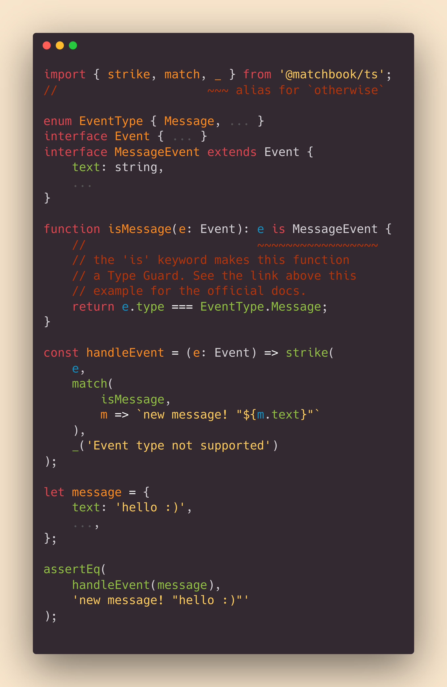

# `@matchbook/ts`
## pattern matching in TypeScript & JavaScript

`@matchbook/ts` is a lightweight & simple pattern matching library,
for TypeScript and JavaScript.

To start using matchbook, install it like any other npm package:

`npm i @matchbook/ts`

If you want to know more about matchbook, keep reading this or [check out the docs!][matchbook_docs]!

---
 
[![npm version][npm_ver_badge]][npm_link]
[![pkg size][npm_size_badge]][npm_link]
[![build][build_badge]][build_link]
[![source rank][source_rank_badge]][libraries_io]

![top lang][lang_badge]
[![codacy][codacy_badge]][codacy_link]
[![codecov][codecov_badge]][codecov_link]
![license][license_badge]

## table of contents

-   [library goals](#library-goals)

-   [pattern matching explained](#pattern-matching-explained)

-   [matchbook at a glance](#matchbook-at-a-glance)

-   [matchbook at a slightly longer glance (examples)](#matchbook-at-a-slightly-longer-glance)
    -   [switching on an `enum`](#switching-on-an-enum)
    -   [acting on the type of an Event](#acting-on-the-type-of-an-event)
    -   [matching if a value is an `instanceof` a constructor](#matching-if-a-value-is-an-instanceof-a-constructor)

## library goals

-   **simple** - API is just **5** functions, along with some aliases
-   **powerful** - type inference backed by Typescript
-   **well documented** - [check out the docs here!][matchbook_docs]
-   **low cost** - no runtime dependencies, small package size
-   **reliable** - 100% unit test coverage, all pushes verified via Travis CI 

## pattern matching explained
Pattern matching is a  modern language feature
that acts like a `switch` / `case` statement
on steroids 💊💪.

You might consider using pattern matching if you
need to switch on Types or states frequently,
and want to handle the different cases in a 
**concise** and **expressive** way.

This project takes heavy inspiration from
[Rust's pattern matching idiom][rust_match].

## matchbook at a glance
want to know more? [read the docs!][matchbook_docs]

## matchbook at a slightly longer glance
want to know more? [read the docs!][matchbook_docs]

### switching on an `enum`

### acting on the type of an Event

### matching if a value is an `instanceof` a constructor

[matchbook_docs]: https://matchbook-ts.github.io/matchbook-ts/docs/
[rust_match]: https://doc.rust-lang.org/book/ch06-02-match.html
[codecov_link]: https://codecov.io/gh/matchbook-ts/matchbook-ts
[codecov_badge]: https://codecov.io/gh/matchbook-ts/matchbook-ts/branch/master/graph/badge.svg
[build_link]: https://travis-ci.org/matchbook-ts/matchbook-ts
[build_badge]: https://travis-ci.org/matchbook-ts/matchbook-ts.svg?branch=master
[npm_ver_badge]: https://img.shields.io/npm/v/@matchbook/ts
[npm_size_badge]: https://img.shields.io/bundlephobia/min/@matchbook/ts
[npm_link]: https://www.npmjs.com/package/@matchbook/ts
[lang_badge]: https://img.shields.io/github/languages/top/matchbook-ts/matchbook-ts
[license_badge]: https://img.shields.io/github/license/matchbook-ts/matchbook-ts
[source_rank_badge]: https://img.shields.io/librariesio/sourcerank/npm/@matchbook/ts
[libraries_io]: https://libraries.io/npm/@matchbook%2Fts
[codacy_badge]: https://api.codacy.com/project/badge/Grade/dd3aa51feb4b4b9988d2a1c9ea543187
[codacy_link]: https://www.codacy.com/gh/matchbook-ts/matchbook-ts?utm_source=github.com&amp;utm_medium=referral&amp;utm_content=matchbook-ts/matchbook-ts&amp;utm_campaign=Badge_Grade
