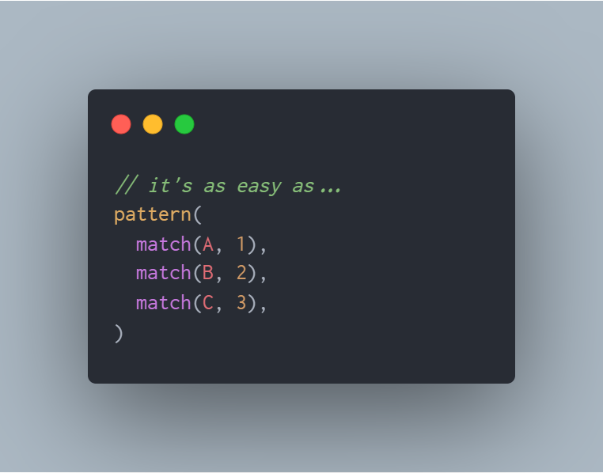
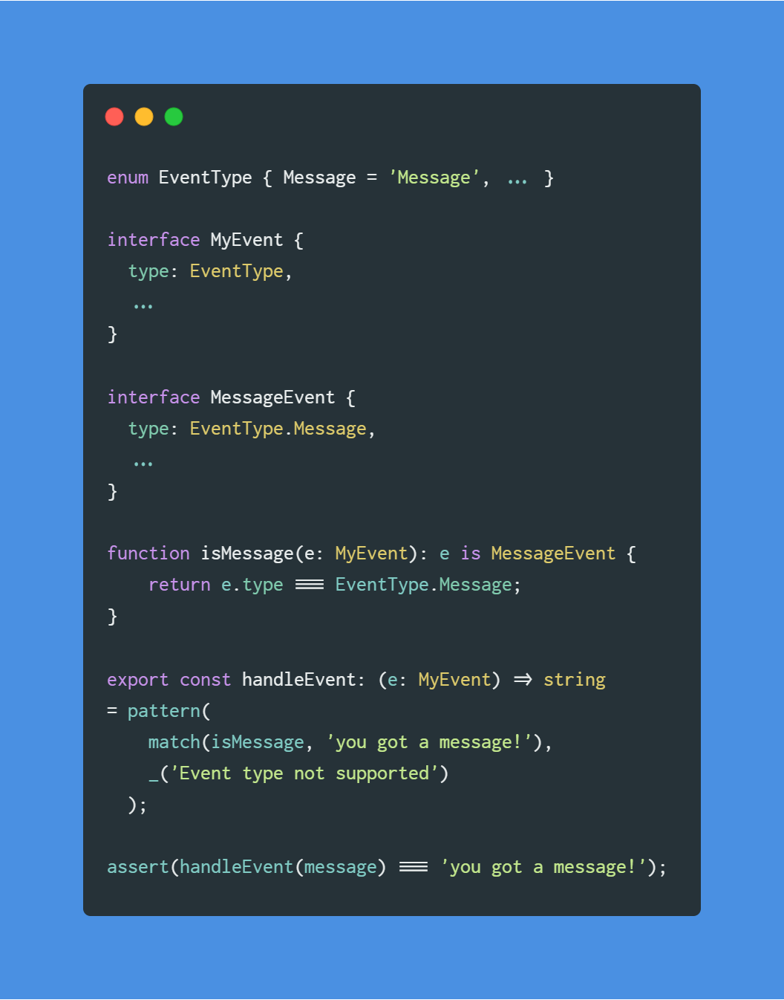

# matchbook

### Pattern Matching in TypeScript & JavaScript

---

### Why you may consider using `matchbook`:
- it has **_zero_** dependencies _**(npm badge here)**_
- reliable [![build][build_badge]][build_link] [![codecov][codecov_badge]][codecov_link]
- simple API
- smart types

---

---

### What is Pattern Matching?
Pattern matching is a  modern language feature
that acts like a `switch` / `case` statement
on steroids 💊💪.

You might consider using pattern matching if you
need to switch on Types or states frequently,
and want to handle the different cases in a 
**concise** and **expressive** way.

This project takes heavy inspiration from
[Rust's pattern matching idiom][rust_match].

### API Docs
Coming soon - `typedoc`

### Examples

#### Handle objects that differ by a discriminator
_A Discriminator is a fancy word for a property on an object
that tells you what kind of object it is._

[liga]: https://github.com/ToxicFrog/Ligaturizer
[rust_match]: https://doc.rust-lang.org/book/ch06-02-match.html
[codecov_link]: https://codecov.io/gh/cakekindel/matchbook
[codecov_badge]: https://codecov.io/gh/cakekindel/matchbook/branch/master/graph/badge.svg
[build_link]: https://travis-ci.org/cakekindel/matchbook
[build_badge]: https://travis-ci.org/cakekindel/matchbook.svg?branch=master
